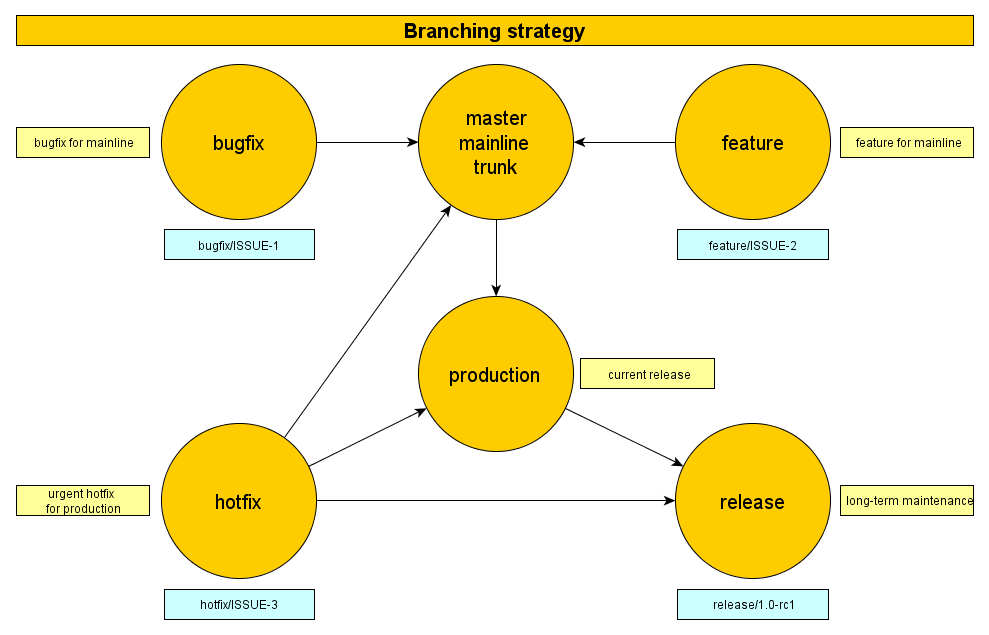
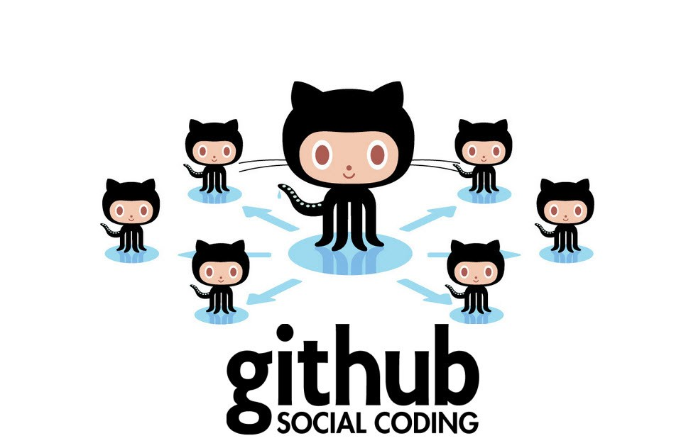

On Git
=======
A Crash Course By
[Michael E Nash](https://github.com/utumno86)

---

Who Am I?
=========


---

Additional Cats
===============


---------------


---------------
Class Resources
================

This presentation and all links in it will be available online
https://github.com/utumno86/BlogPosts/blob/master/GitPresentation.md

Presentation written with [Marp](https://yhatt.github.io/marp/)

-------------

What is a version control system?
=================================

From Wikipedia -

"... management of changes to documents, computer programs, large web sites, and other collections of information."

----------------------------


------------
Linus Torvalds
==============
Invented git in 2005


-------------

Installing Git
==============
- OsX 
	- install Homebrew [brew.sh](brew.sh)
	```
    brew install git
    ```
- Windows
  - install git for windows [https://gitforwindows.org/](https://gitforwindows.org/)

Git Website [https://git-scm.com/](https://git-scm.com/)

------

Configuration Overview
======================

- Personal info
```
git config --global user.name "John Doe"
git config --global user.email johndoe@example.com
```
- Editor
```
 git config --global core.editor emacs
 ```
- Aliases (optional)
```
git config --global alias.co checkout
git config --global alias.br branch
git config --global alias.ci commit
git config --global alias.st status
```
-------

Gitignore Global
================

```
git config --global core.excludesfile '~/.gitignore_global'
```
```
touch ~/.gitignore_global
```
Suggested Gitignore contents:
[https://github.com/github/gitignore](https://github.com/github/gitignore)

-----


Basic Git Commands
==================

```
git init
```
```
git add .
```
```
git commit -m "message"
```
----------

How Do I Get Out of Vim?
=======================

```:q```
[How To Exit the Vim Editor](https://stackoverflow.com/questions/11828270/how-to-exit-the-vim-editor)

---

Git Branching
=============


-------------

Git Branching Commands
======================

```
git checkout -b testing
```
```
git branch
```
```
git checkout master
```
```
git merge testing
```
---

*Remote Repositories* Workflow
===================


----

Github
======



---

SSH
===
from Wikipedia: "Secure Shell (SSH) is a cryptographic network protocol for operating network services securely over an unsecured network. ... The best known example application is for remote login to computer systems by users."

---

Steps to Set Up an SSH Connection With Github
=============================================

1) [Check for existing SSH Keys](https://help.github.com/articles/checking-for-existing-ssh-keys/)
2) [Generating a New SSH Key and/or adding it to the SSH agent](https://help.github.com/articles/generating-a-new-ssh-key-and-adding-it-to-the-ssh-agent/)
3) [Add the SSH Key To Your Github](https://help.github.com/articles/adding-a-new-ssh-key-to-your-github-account/)

---

Git Clone
=========

[Git tutorial repo](https://github.com/utumno86/git_tutotial)

```git clone git@github.com:utumno86/git_tutotial.git GitTutorial```

---

Git Remote
==========

```
git remote
```
```
git remote add origin git@github.com:utumno86/git_tutotial.git
```
----

Interacting With Remote Repositories
====================================

```git push```
``` git pull ```

Additional command: ```git fetch ```

----

Resoliving Merge Conflicts
==========================


