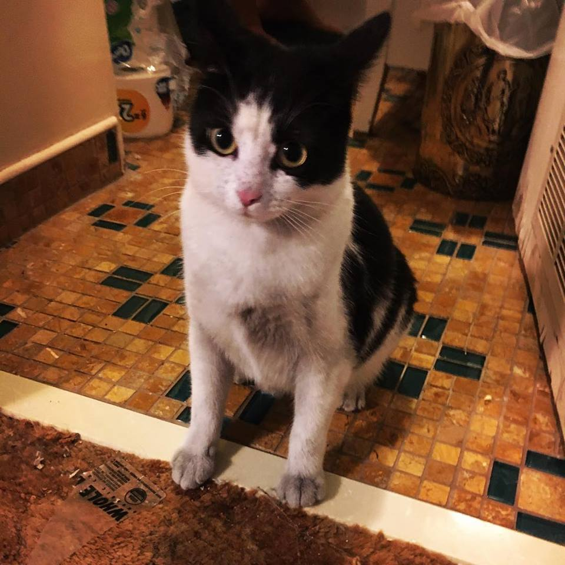
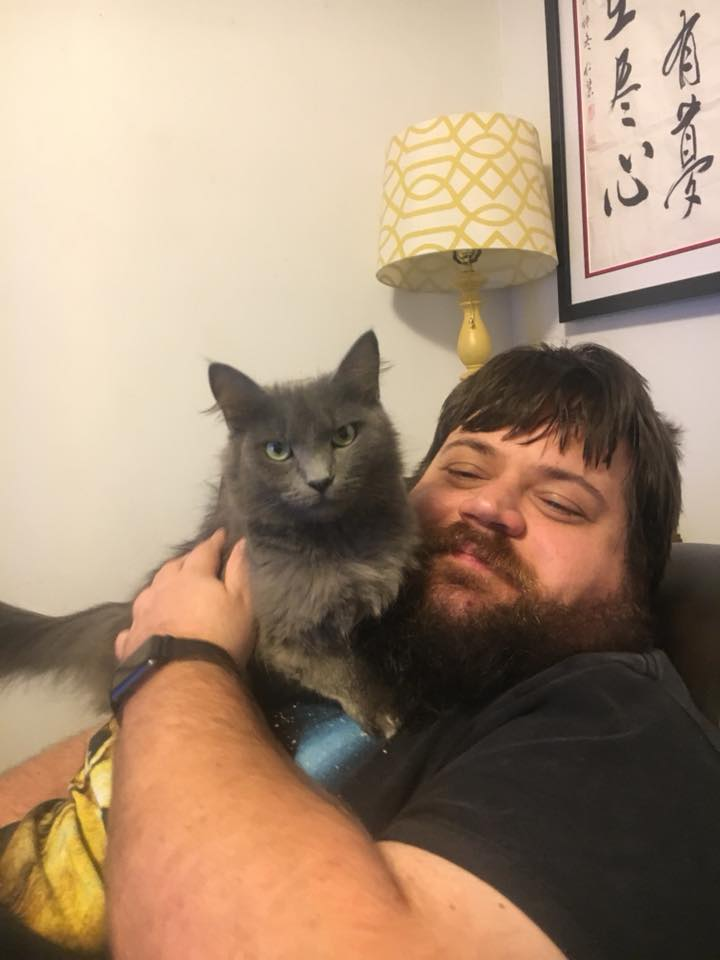

On Git
=======
A Crash Course By
[Michael E Nash](https://github.com/utumno86)

---

Who Am I?
=========

---

Additional Cats
===============

---------------

---------------
Class Resources
================

This presentation and all links in it will be available online
https://github.com/utumno86/BlogPosts/blob/master/GitPresentation.md

Presentation written with [Marp](https://yhatt.github.io/marp/)

-------------

What is a version control system?
=================================

From Wikipedia -

"... management of changes to documents, computer programs, large web sites, and other collections of information."